# The Art of Agent Updates: A Comedy of Errors

*Or: How I learned to stop worrying and love GitHub Actions*

---

## The Problem: Updating Agents is Like Herding Cats

Picture this: You have a fleet of Windows agents scattered across your network. They're happily collecting inventory, running jobs, and generally being good little worker bees. Then you find a bug. Or add a feature. Or—horror of horrors—fix a security issue.

Now you need to update them all.

**"How hard can it be?"** — Famous last words.

---

## The Manual Update Dance 💃

Here's what manual agent updates look like in practice:

1. Build on your dev machine
2. RDP into Server #1
3. Stop the service
4. Copy files
5. Start the service
6. Pray it works
7. Repeat for Server #2, #3, #4...
8. Realize you forgot to include that one DLL
9. Start over from step 1
10. Question your life choices

By the time you're done, it's 3 AM, you've consumed 47 cups of coffee, and Server #7 is somehow running a version from 2019.

---

## The Challenges Nobody Warns You About

### 🔒 The File Lock Problem

Windows services LOVE holding onto their executables. Try to overwrite a running DLL and Windows will laugh at you. Then cry. Then give you a cryptic error about "being used by another process."

**Solution:** Stop the service first, update files, restart. Simple in theory, nightmare in practice when you're managing 50 machines.

### 🔐 The Signature Dance

Modern agents use cryptographic signatures for authentication. When you update an agent:

- Old signature? "Who dis?"
- New key generated? "I don't know you anymore"
- Wrong payload format? "device signature invalid" (ask me how I know)

We literally spent hours debugging why our agents couldn't connect after an update. Turns out, the signature payload format wasn't:

```
nonce:timestamp
```

It was:

```
v2|deviceId|clientId|clientMode|role|scopes|signedAtMs|token|nonce
```

*Fun times.*

### 🐔 The Chicken-Egg Problem

You want to push an update to your agents via the agent infrastructure... but the agents need the update to connect to the infrastructure.

It's like trying to download a browser using the browser you don't have yet.

### 🔢 The Version Confusion

"What version are you running?"  
"1.0.0.0"  
"No, that's the assembly version, I mean the actual version"  
"0.3.12"  
"Wait, the logs say 0.3.8"  
"That's from the old install"  
*screaming internally*

---

## Enter: The CI/CD Pipeline 🚀

After experiencing all of the above (sometimes multiple times in one afternoon), we built a proper pipeline. Here's how it works:

```mermaid
flowchart TD
    A[👨‍💻 Developer pushes code] --> B[🏷️ Create git tag v0.X.Y]
    B --> C[🚀 GitHub Actions triggers]
    C --> D[🪟 Build on Windows runner]
    D --> E[📦 Create ZIP + SHA256]
    E --> F[📢 Publish GitHub Release]
    F --> G[⏰ Agents check hourly]
    G --> H{New version?}
    H -->|No| I[😴 Sleep for 1 hour]
    I --> G
    H -->|Yes| J[📥 Download new version]
    J --> K[⏹️ Stop service]
    K --> L[📋 Backup current exe]
    L --> M[📂 Copy new files]
    M --> N[▶️ Start service]
    N --> O[✅ Log success]
    O --> P[🧹 Cleanup temp files]
    P --> G
```



### The Beautiful Simplicity

**Before CI/CD:**

```
Me: *builds locally*
Me: *SCPs to server*
Me: *SSHs in*
Me: *stops service*
Me: *copies files*
Me: *starts service*
Me: *checks logs*
Me: *finds bug*
Me: *cries*
Me: *repeats 47 times*
```

**After CI/CD:**

```
Me: git tag v0.3.15
Me: git push --tags
Me: *drinks coffee*
Agents: *update themselves*
```

---

## The GitHub Actions Workflow

Here's the magic sauce:

```yaml
name: Build and Release

on:
  push:
    tags:
      - 'v*'

jobs:
  build:
    runs-on: windows-latest
    
    steps:
      - uses: actions/checkout@v4
      
      - uses: actions/setup-dotnet@v4
        with:
          dotnet-version: '8.0.x'
      
      - run: dotnet publish -c Release -r win-x64 --self-contained
      
      - name: Create ZIP
        shell: pwsh
        run: |
          Compress-Archive -Path publish/* -DestinationPath release.zip
          (Get-FileHash release.zip -Algorithm SHA256).Hash > release.zip.sha256
      
      - uses: softprops/action-gh-release@v1
        with:
          files: |
            release.zip
            release.zip.sha256
```

That's it. Push a tag, get a release. No RDP. No manual copying. No 3 AM debugging sessions.

---

## The Self-Updating Agent

The real magic is in the agent itself. Every hour, it:

1. Checks GitHub releases API for the latest version
2. Compares with its current version
3. If newer: downloads, stops itself, updates, restarts
4. Logs everything to `C:\ProgramData\OpenClaw\logs\update.log`

```csharp
// Simplified version check
var release = await httpClient.GetFromJsonAsync<GitHubRelease>(
    "https://api.github.com/repos/.../releases/latest");

if (IsNewerVersion(currentVersion, release.TagName))
{
    await DownloadAndInstall(release.Assets[0].DownloadUrl);
}
```

The update script itself is PowerShell, generated at runtime:

```powershell
# Wait for service to stop
$timeout = 60
while ($elapsed -lt $timeout) {
    $svc = Get-Service -Name "OpenClawNodeAgent"
    if ($svc.Status -eq 'Stopped') { break }
    Start-Sleep -Seconds 1
}

# Backup, copy, restart
Copy-Item "$installDir\*.exe" "$backupDir\" -Force
Copy-Item "$sourceDir\*" "$installDir\" -Recurse -Force
Start-Service -Name "OpenClawNodeAgent"
```

---

## Lessons Learned

1. **Automate everything.** If you're doing it more than twice, script it.

2. **Version numbers matter.** Use semantic versioning. Embed it in the assembly. Read it at runtime. Trust nothing else.

3. **Signature formats are sacred.** Document them. Test them. Don't assume.

4. **Self-updating agents are worth the effort.** The initial setup takes a day. The time saved over a year? Immeasurable.

5. **GitHub Actions is free for public repos.** Use it. Abuse it. Love it.

---

## The Result

We went from "updating 3 agents takes 2 hours and my sanity" to "push tag, drink coffee, done."

The agents now form a happy, self-maintaining family—like lobsters emerging from their shells, ready to serve. 🦞

---

*Next up: Building the package management UI so we can deploy software to endpoints without touching a single machine.*

**[View the project on GitHub →](https://github.com/BenediktSchackenberg/openclaw-windows-agent)**
